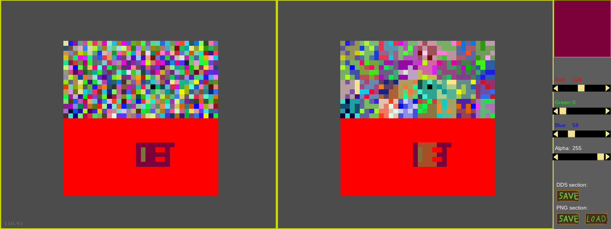

# About this is "Editor"

This "Editor" is created ONLY for showing and experiments with converting **PNG** files on **DDS** files.
 
It's not intended for creating images, because a lot of things are missed which could be required such purpose.

It's tested only on **Ubuntu** 18.04 and python 3.6.6.
 
Library requirements locate in [requirements.txt](requirements.txt)

**"Editor" could open only PNG files in RGBA format(32 bit per pixel)**

GUI example(left part in PNG, right part is DDS(DXT5)):

**Shortcuts and usage:**
- Ctrl + P -> make screenshot
- drawing is allowed on left part of GUI
- mouse scroll -> zoom
- mouse wheel hold and move -> move image
- left mouse click on left side -> draw
- sliders on right panel -> change color

**Save as DDS:** 
- Only DXT5 is available from box. (You could change it in hardcoded place - find `image.library.MagickSetOption(img.wand, b"dds:compression", b"dxt5")` line)
- If you need to flip result DDS image - find `# img.flip()` and uncomment it

**Initial script is** `editor/run_editor.py`
